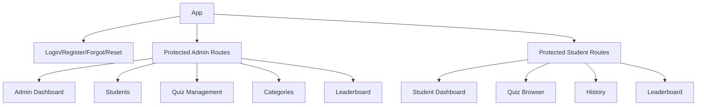
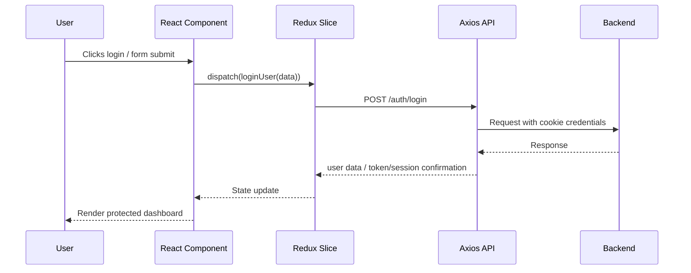

# 🎯 QuizVerse Frontend

<div align="center">


**Frontend application for the QuizVerse platform — built with React, Redux, protected routing, and a role-specific interface for admins and students.**

</div>

---

## 📋 Overview

The frontend is a Vite-powered React application with a role-based UI. It includes:

- Admin dashboard and management tools
- Student dashboard and quiz-taking experience
- Protected routes based on authentication and user role
- Shared Redux slices for app state management
- Toast-based feedback and session-based auth persistence

The app is split into two primary experiences:

- Admin portal for platform management
- Student portal for quiz discovery, attempt tracking, and results

---

## ✨ Key Features

- Secure login, registration, forgot password, and reset flows
- Role-based route protection
- Admin dashboard with platform metrics
- Student dashboard with personal performance insights
- Quiz browsing and filtering by search/category/difficulty
- Attempt start, timer handling, answer submission, and review
- Leaderboard views for students and admins
- Student profile history and performance tracking
- Clean, modern UI built with Tailwind styling and glassmorphism-inspired design tokens

---

## 🧱 Application Structure

```text
frontend/
├── DESIGN.md                    # Design tokens and styling system
├── eslint.config.js            # ESLint configuration
├── index.html                  # Root HTML entry
├── package.json                # Scripts and dependencies
├── vite.config.js              # Vite + React + Tailwind config
├── vercel.json                 # Deployment config
├── public/
│   └── images/
│       └── logo assets
├── src/
│   ├── App.jsx                 # App routing and protected route setup
│   ├── main.jsx                # React bootstrap and router provider
│   ├── index.css               # Global styles and theme defaults
│   ├── https/
│   │   └── axios.js            # Axios instance with cookie auth + 401 redirect
│   ├── components/
│   │   ├── ProtectedRoutes.jsx # Role-based route guard
│   │   ├── admin/
│   │   │   ├── categories/
│   │   │   ├── dashboard/
│   │   │   ├── quizzes/
│   │   │   └── users/
│   │   ├── auth/
│   │   ├── common/
│   │   ├── layouts/
│   │   └── student/
│   ├── pages/
│   │   ├── Admin/
│   │   ├── Student/
│   │   ├── Login.jsx
│   │   ├── Register.jsx
│   │   ├── ForgotPassword.jsx
│   │   ├── ResetPassword.jsx
│   │   └── Unauthorized.jsx
│   └── redux/
│       ├── store.js
│       └── slices/
│           ├── adminCategoriesSlice.js
│           ├── adminDashboardSlice.js
│           ├── adminQuestionsSlice.js
│           ├── adminQuizzesSlice.js
│           ├── adminUsersSlice.js
│           ├── authSlice.js
│           ├── leaderboardSlice.js
│           ├── studentAttemptSlice.js
│           ├── studentDashboardSlice.js
│           └── studentQuizzesSlice.js
└── README.md                   # Project frontend docs
```

---

## 🧭 Routing Architecture

The app uses React Router and a role-based gate for access.



### Top-Level Routes

- `/login`
- `/register`
- `/forgot-password`
- `/reset-password`
- `/unauthorized`

### Admin Routes

- `/admin/dashboard`
- `/admin/users`
- `/admin/users/:id`
- `/admin/quizzes`
- `/admin/quizzes/new`
- `/admin/quizzes/:id/edit`
- `/admin/quizzes/:quizId/questions`
- `/admin/quizzes/:quizId/questions/new`
- `/admin/quizzes/:quizId/questions/:questionId/edit`
- `/admin/categories`
- `/admin/categories/new`
- `/admin/categories/:id/edit`
- `/admin/leaderboard`

### Student Routes

- `/student/dashboard`
- `/student/quizzes`
- `/student/quizzes/:id`
- `/student/quizzes/:id/take`
- `/student/attempts/:id/results`
- `/student/history`
- `/student/leaderboard`

---

## 🔐 Authentication & Route Guarding

### Auth Strategy

- login response includes user data and JWT cookie
- cookie is sent automatically via `withCredentials: true`
- user info is stored in `sessionStorage`
- app state keeps `isAuthenticated` and `user`

### ProtectedRoute Logic

The `ProtectedRoutes.jsx` component checks:

- whether the user is authenticated
- whether their role matches the allowed route role

If access is denied, the user is redirected to:

- `/login` when not authenticated
- their role dashboard when authenticated but unauthorized

### Axios Interceptor

The global Axios instance:

- uses `baseURL` from `VITE_API_URL`
- sends credentials with every request
- intercepts `401 Unauthorized` responses
- clears `sessionStorage` and redirects to `/login`

---

## 📦 State Management

The app uses Redux Toolkit with multiple slices.

### Store Summary

| Slice | Responsibility |
|---|---|
| `auth` | login/logout/register/user session |
| `adminUsers` | student list and profile management |
| `adminQuizzes` | quiz CRUD and admin quiz state |
| `adminCategories` | category fetch/create/update/delete |
| `adminQuestions` | question CRUD for specific quizzes |
| `adminDashboard` | admin stats and platform metrics |
| `studentQuizzes` | quiz listing and details for students |
| `studentAttempt` | quiz attempts, timer state, submission, reviews |
| `studentDashboard` | student metrics and performance data |
| `leaderboard` | leaderboard rankings |

### State Pattern

Each slice follows a consistent structure:

- `loading`
- `error`
- `data` or `list` or `current` object
- async thunks using `createAsyncThunk`
- reducers that update status on pending/fulfilled/rejected

---

## 🧩 Layout and UI Structure

### Layouts

#### AdminLayout
- top navigation for dashboard, students, quizzes, categories, leaderboard
- user profile chip
- logout button
- `Outlet` for nested pages

#### StudentLayout
- top navigation for dashboard, discover quizzes, history, leaderboard
- logged-in student profile chip
- logout button
- `Outlet` for nested pages

### UI Style

The app uses a custom design system described in `DESIGN.md` and Tailwind utility classes. It includes a polished, warm, glassmorphism-inspired aesthetic with:

- soft backgrounds
- rounded panels
- subtle shadows
- status color accents
- responsive card layouts

---

## 🧑‍💼 Admin Experience

The admin interface includes:

- platform dashboard stats
- list of student accounts
- status switching for active/inactive accounts
- quiz management including create/edit/delete
- question editor with correct option management
- category CRUD
- leaderboard visibility and platform analytics

### Typical Admin Flow

1. Log in as `ADMIN`
2. View dashboard metrics
3. Manage students and quiz content
4. Publish or unpublish quizzes
5. Review platform analytics and leaderboard

---

## 🎓 Student Experience

The student experience includes:

- login and registration
- browse published quizzes
- review quiz details
- start quiz attempts with timer enforcement
- submit answers
- get score summary and answer review
- view personal history and leaderboard performance

### Typical Student Flow

1. Sign up or log in
2. View published quizzes
3. Open a quiz detail page
4. Start the attempt
5. Submit answers
6. Review attempt results and explanations

---

## 📊 Data Flow in Frontend



---

## ⚙️ Environment Configuration

Create a `.env` file inside `frontend/`:

```env
VITE_API_URL=your_backend_url
```

This URL is used by Axios as the API base and must match the backend server location.

---

## ▶️ Run the App

### Install dependencies

```bash
cd frontend
npm install
```

### Start the frontend

```bash
npm run dev
```

### Production build

```bash
npm run build
```

### Preview production build

```bash
npm run preview
```

### Lint the code

```bash
npm run lint
```

---

## 📦 Dependencies

### Core

- `react` and `react-dom`
- `react-router-dom` for routing
- `@reduxjs/toolkit` and `react-redux` for state
- `axios` for API communication
- `react-toastify` for notifications

### UI & Styling

- `tailwindcss`
- `@tailwindcss/vite`
- `lucide-react` for icons
- `recharts` for charts and analytics visualization

### Form & Validation

- `react-hook-form`
- `@hookform/resolvers`

### Build / Tooling

- `vite`
- `eslint`
- `@vitejs/plugin-react`

---

## 🧠 Key Implementation Notes

- `sessionStorage` is used to persist the current user across a browser tab
- routes are separated into protected admin and student sections
- the app gates user access before rendering page content
- each slice handles async API calls and state updates independently
- the dashboard data is fetched at the page/component level and stored in Redux

---

## 📌 Summary

The frontend is a modern React application built for a quiz platform with clear separation between admin and student experiences. It uses Redux for predictable state handling, React Router for navigation, and a consistent UI layer to support the platform’s quiz, leaderboard, and analytics workflows.

Together with the backend, it forms a complete, role-aware quiz management system with secure authentication and a strong user experience for both administrators and students.
